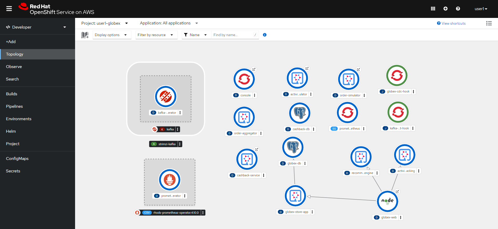

= Getting Started with the Workshop

In this module you will get familirized with the resources available to you in this workshop. 

== Accessing OpenShift

All the tools and resources you need to execute this workshop are available in OpenShift, so to get started, let's log in OpenShift. 

[IMPORTANT]
====
Here are the access details:

* Console URL: {console_url}
* User: `{user}`
* Password: `{password}`
====

First you need to select how you want to authenticate. For this workshop we will use *cognito* as our authentication option: 

After your selection you'll be able to enter your username and password:

This is take you to the initial page. This page will show you what projects(namespaces) are available to you: 

== Projects available to you

In this workshop you will interact with 3 different projects. Let's learn about them.

=== {user}-globex

This is our mock e-commerce system. We will wire integrations to you to add functionality to the system. You are able to visualize what is in the project, but you are not able to change things.

=== {user}-devspaces

Your IDE workspace is running here. You are able to visualize it but are not able to change it.

=== {user}-camel

This is the project you'll use to deploy integrations. We already have some operators set up for you. You'll use them in the upcoming modules.

== Using Dev Spaces

Let's get used to our IDE. Go back to the OpenShift {console_url}[console]. In the top right corner, click on the grid, then select `Red Hat OpenShift Dev Spaces`.

Once you click, you will be asked to authenticate again and authorize the service to access your user account.

Click on `Allow selected permissions`. That will take you to the Dev Spaces dashboard.

